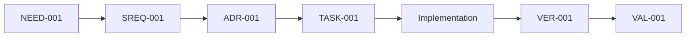

# Traceability Matrix Template

Use this template when the `systems-engineering-traceability` skill needs a durable traceability artifact.

Recommended path:

```text
docs/traceability/[scope].md
```

The Markdown matrix is the audit record for trace links, status, evidence references, gaps, and human decisions. Source artifacts remain authoritative for their detailed content. Mermaid diagrams are visual views only.

## File Skeleton

````markdown
# Traceability: [Scope]

## System Context

System:
Subsystem:
Scope:
Owner:
Status: Draft
Last updated:

Success signal:
Failure signal:

## Stakeholder Needs

| ID | Need | Stakeholder | Success Signal | Status |
|---|---|---|---|---|
| NEED-001 |  |  |  | Draft |

## Requirements

| ID | Requirement | Source Need | Acceptance Criteria | Priority | Status |
|---|---|---|---|---|---|
| SREQ-001 |  | NEED-001 |  | Must | Draft |

## Design Decisions

| ID | Decision / ADR | Linked Requirements | Rationale Source | Status |
|---|---|---|---|---|
| ADR-001 | `docs/decisions/adr-001.md` | SREQ-001 |  | Draft |

## Traceability Matrix

| Requirement | Need | Design / ADR | Plan / Task | Implementation | Verification | Validation | Owner | Status | Gaps |
|---|---|---|---|---|---|---|---|---|---|
| SREQ-001 | NEED-001 | ADR-001 | TASK-001 | `src/module/file.ts` | VER-001 | VAL-001 |  | Draft | GAP-001 |

## Document Chain Links

| Requirement | Requirements Doc | Plan / Task Doc | ATP Entry | Result Record | Status |
|---|---|---|---|---|---|
| SREQ-001 | `docs/specs/example.md` | `docs/plans/example-plan.md#task-1` | ATP-001 | RESULT-001 | Draft |

## ATP Entries

ATP means acceptance test plan or acceptance test procedure.

| ID | Requirement | Procedure / Scenario | Expected Result | Owner | Status |
|---|---|---|---|---|---|
| ATP-001 | SREQ-001 |  |  |  | Draft |

## Result Records

Result records may be acceptance test results, verification output, or acceptance test report artifacts.

| ID | Requirement | ATP / Method | Evidence Artifact | Result | Date / Session |
|---|---|---|---|---|---|
| RESULT-001 | SREQ-001 | ATP-001 |  | Pending |  |

## Verification Evidence

| ID | Requirement | Method | Evidence | Result | Date / Session | Notes |
|---|---|---|---|---|---|---|
| VER-001 | SREQ-001 | Unit / integration / E2E / build / static analysis / inspection |  | Pending |  |  |

## Validation Evidence

| ID | Source Need | Scenario | Evidence | Result | Owner |
|---|---|---|---|---|---|
| VAL-001 | NEED-001 |  |  | Pending / Accepted / Rejected / Deferred |  |

## Traceability Diagram



If the diagram and matrix disagree, update the diagram from the matrix. The matrix wins.

## Traceability Gaps

| ID | Description | Affected IDs | Risk | Owner | Action | Status |
|---|---|---|---|---|---|---|
| GAP-001 |  | SREQ-001 |  |  |  | Open |

## Dark-Code Candidates

| Candidate | Location | Why Flagged | Suggested Action | Owner | Status |
|---|---|---|---|---|---|
|  | `src/module/file.ts` | No linked requirement / no test / unclear validation / unclear owner | Keep and document / test and verify / validate / deprecate / remove / escalate |  | Open |

## Human Decisions Required

| ID | Question | Options | Recommendation | Status |
|---|---|---|---|---|
| DEC-001 |  |  |  | Open |

## Change Impact Analysis

Change:

Affected needs:
Affected requirements:
Affected design decisions:
Affected implementation:
Affected verification:
Affected validation:
Risks introduced:
Human decision required:
````

## Status Values

Use these status values consistently:

| Status | Meaning | Required Evidence |
|---|---|---|
| `Draft` | Proposed or inferred; not yet approved. | Source artifact or agent note plus required human decision. |
| `Approved` | Accepted requirement, decision, or gap. | Human approval record with approver, date/session, source artifact, and affected IDs. |
| `Implemented` | Implementation artifacts linked. | Files, modules, interfaces, tasks, or config linked to requirement or design IDs. |
| `Verified` | Technical requirement has evidence. | Test, ATP, build, static analysis, or inspection result linked to the requirement. |
| `Validated` | Stakeholder need satisfied in context. | Demo, UAT, scenario, operational evidence, telemetry, or accepted validation result. |
| `Gap` | Missing, stale, contradictory, or unapproved trace link. | Gap description, risk, owner, and next action. |
| `Deferred` | Valid trace item intentionally postponed. | Owner, reason, expected follow-up, and accepted risk. |
| `Retired` | Requirement, behavior, or artifact no longer active. | Deprecation or removal rationale and impact analysis. |

## Lightweight Mode

For a small change, use a compact trace note instead of the full matrix:

```markdown
Traceability note:
- Need / requirement:
- Design decision / risk control:
- Implementation:
- Verification:
- Validation or validation path:
- Gaps or human decisions:
```

Do not use Lite mode to hide unclear or risky behavior. If the reason, verification, validation, or owner is unclear, switch to Standard or Audit mode.
